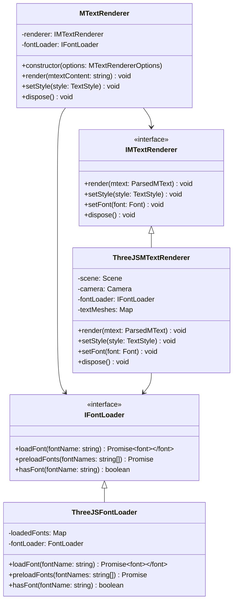
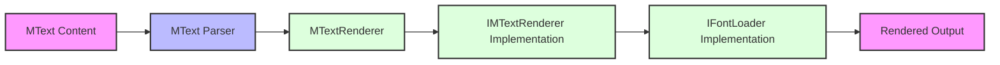

# MText Renderer for Three.js

A flexible and extensible AutoCAD MText renderer implementation using Three.js. This package provides a modular architecture to render AutoCAD MText content with different rendering engines, with a primary focus on Three.js rendering.

## Features

- 🎨 Render AutoCAD MText content using Three.js
- 🔌 Pluggable rendering interface for different rendering engines
- 📦 Modular font loading system
- 🛠️ Built on top of @mlightcad/mtext-parser mtext parser
- 🎯 Highly customizable text styling and formatting
- ⚡ Efficient rendering with Three.js optimizations

## Architecture

The package is designed with modularity and extensibility in mind. Here's the high-level architecture:



## Module Interactions



## Core Components

### 1. IMTextRenderer Interface

The core rendering interface that defines how MText content should be rendered. This allows for different rendering implementations:

```typescript
interface IMTextRenderer {
    render(mtext: ParsedMText): void;
    setStyle(style: TextStyle): void;
    setFont(font: Font): void;
    dispose(): void;
}
```

### 2. IFontLoader Interface

A pluggable font loading system that allows users to implement their own font loading mechanisms:

```typescript
interface IFontLoader {
    loadFont(fontName: string): Promise<Font>;
    preloadFonts(fontNames: string[]): Promise<void>;
    hasFont(fontName: string): boolean;
}
```

### 3. ThreeJSMTextRenderer

The primary Three.js implementation of the MText renderer:

```typescript
class ThreeJSMTextRenderer implements IMTextRenderer {
    // Implementation details for Three.js rendering
}
```

## Usage

```typescript
import { MTextRenderer, ThreeJSMTextRenderer, ThreeJSFontLoader } from 'mtext-renderer';

// Create a new renderer instance
const renderer = new MTextRenderer({
    renderer: new ThreeJSMTextRenderer({
        scene: yourThreeJSScene,
        camera: yourThreeJSCamera
    }),
    fontLoader: new ThreeJSFontLoader()
});

// Render MText content
renderer.render(`
    {\\fArial|b0|i0|c0|p34;Hello World}
`);
```

## Implementation Guidelines

### Rendering Engine Implementation

To implement a new rendering engine:

1. Create a class that implements `IMTextRenderer`
2. Implement all required methods
3. Handle text positioning, styling, and formatting
4. Manage resource cleanup in the dispose method

### Font Loader Implementation

To implement a custom font loader:

1. Create a class that implements `IFontLoader`
2. Implement font loading logic
3. Handle font caching if needed
4. Implement font preloading for better performance

## Development

### Prerequisites

- Node.js >= 14
- Three.js
- @mlightcad/mtext-parser

### Installation

```bash
npm install mtext-renderer
```

## License

MIT

## Contributing

Contributions are welcome! Please read our contributing guidelines for details. 