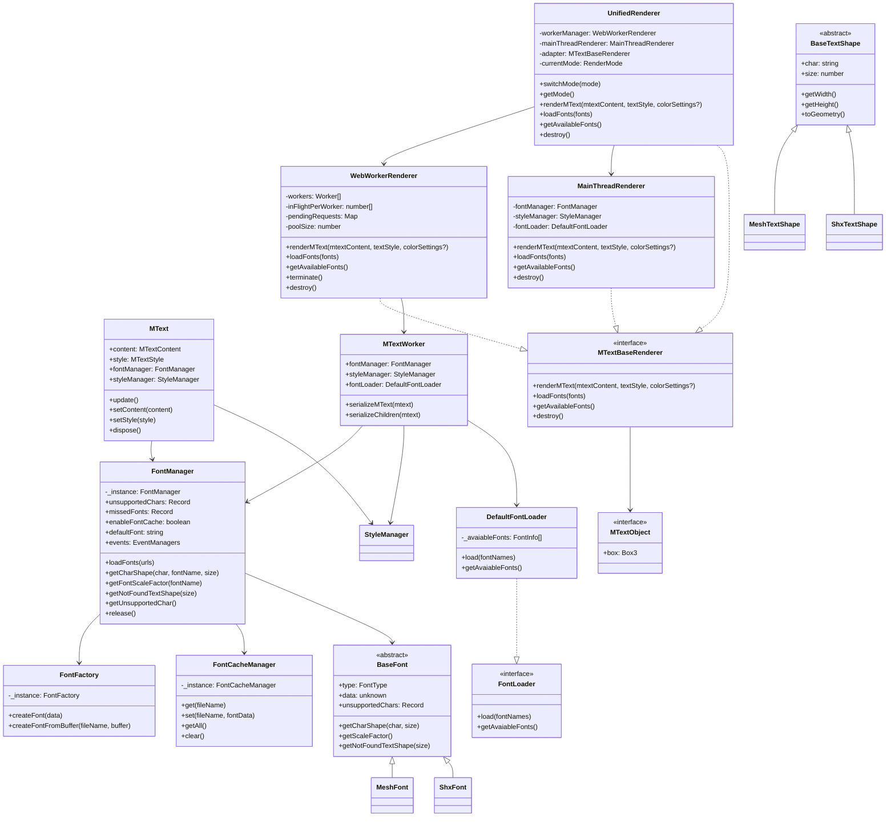

# MText Renderer for Three.js

A flexible and extensible AutoCAD MText renderer implementation using Three.js. This package provides a modular architecture to render AutoCAD MText content with different rendering engines, with a primary focus on Three.js rendering.

## Features

- Render AutoCAD MText content using Three.js
- Modular font loading system
- Font management and dynamic font loading
- Cache parsed fonts to improve rendering performance

## Core Components

### FontManager

The central manager for font operations. It's a singleton class that handles font loading, caching, and text rendering.

**Public Properties:**
- `unsupportedChars`: Record of characters not supported by any loaded font
- `missedFonts`: Record of fonts that were requested but not found
- `enableFontCache`: Flag to enable/disable font caching. If it is true, parsed fonts 
will be stored in local IndexedDB to improve performance. Default value is true.
- `defaultFont`: Default font to use when a requested font is not found
- `events`: Event managers for font-related events
  - `fontNotFound`: Triggered when a font cannot be found
  - `fontLoaded`: Triggered when a font is successfully loaded

**Public Methods:**
- `loadFonts(urls)`: Loads fonts from URLs
- `getCharShape(char, fontName, size)`: Gets text shape for a character
- `getFontScaleFactor(fontName)`: Gets scale factor for a font
- `getNotFoundTextShape(size)`: Gets shape for not found indicator
- `getUnsupportedChar()`: Gets record of unsupported characters
- `release()`: Releases all loaded fonts

### FontLoader & DefaultFontLoader

Interface for font loading operations. The default implementation [DefaultFontLoader](./src/font/defaultFontLoader.ts) uses a [CDN-based font repository](https://cdn.jsdelivr.net/gh/mlight-lee/cad-data/fonts/). It loads font metadata from a JSON file and provides access to available fonts. You can implement one font loader by your own if you want to use fonts hosted in your own server.

**Public Methods:**
- `load(fontNames)`: Loads specified fonts into the system
- `getAvaiableFonts()`: Retrieves information about available fonts

### BaseFont

Abstract base class for font implementations. Provides common functionality for font handling.

**Public Properties:**
- `type`: Type of font ('shx' or 'mesh')
- `data`: Parsed font data
- `unsupportedChars`: Record of unsupported characters

**Public Methods:**
- `getCharShape(char, size)`: Gets shape for a character
- `getScaleFactor()`: Gets font scale factor
- `getNotFoundTextShape(size)`: Gets shape for not found indicator

### BaseTextShape

Abstract base class for text shape implementations. Provides common functionality for text shape handling.

**Public Properties:**
- `char`: Character this shape represents
- `size`: Size of the text shape

**Public Methods:**
- `getWidth()`: Gets width of text shape
- `getHeight()`: Gets height of text shape
- `toGeometry()`: Converts shape to THREE.BufferGeometry

### FontFactory

Singleton factory class for creating font instances. Handles creation of appropriate font objects based on type and data format.

**Public Methods:**
- `createFont(data)`: Creates font from font data
- `createFontFromBuffer(fileName, buffer)`: Creates font from file data

### FontCacheManager
Manages font data caching using IndexedDB. Provides persistent storage for font data.

**Public Methods:**
- `get(fileName)`: Retrieves font data from cache
- `set(fileName, fontData)`: Stores font data in cache
- `getAll()`: Retrieves all cached font data
- `clear()`: Clears all cached font data

## Worker-Based Rendering System

The package provides a sophisticated worker-based rendering system that allows MText rendering to be performed in Web Workers, preventing blocking of the main UI thread. This is particularly beneficial for rendering large amounts of text or complex MText content.

### MTextBaseRenderer Interface

Defines the common rendering contract for producing Three.js objects from MText content. All renderer implementations must conform to this interface.

**Public Methods:**
- `renderMText(mtextContent, textStyle, colorSettings?)`: Render MText content into a Three.js object hierarchy
- `loadFonts(fonts)`: Ensure specified fonts are available to the renderer
- `getAvailableFonts()`: Retrieve list of fonts that can be used by the renderer
- `destroy()`: Release any resources owned by the renderer

### MTextObject Interface

Represents a rendered MText object that extends THREE.Object3D with additional MText-specific properties.

**Public Properties:**
- `box`: The bounding box of the MText object in local coordinates

### MainThreadRenderer

Renders MText content directly in the main thread. This is the simplest renderer implementation that provides the same interface as worker-based renderers but runs synchronously in the main thread.

**Public Methods:**
- `renderMText(mtextContent, textStyle, colorSettings?)`: Render MText directly in the main thread
- `loadFonts(fonts)`: Load fonts in the main thread
- `getAvailableFonts()`: Get available fonts from the main thread
- `destroy()`: Cleanup resources

### WebWorkerRenderer (MTextWorkerManager)

Manages communication with MText Web Workers for parallel text rendering. This renderer uses a pool of Web Workers to distribute rendering tasks, improving performance for large text content.

**Public Properties:**
- `poolSize`: Number of workers in the pool (defaults to optimal size based on hardware concurrency)

**Public Methods:**
- `renderMText(mtextContent, textStyle, colorSettings?)`: Render MText using worker pool
- `loadFonts(fonts)`: Load fonts in all workers
- `getAvailableFonts()`: Get available fonts from workers
- `terminate()`: Terminate all workers
- `destroy()`: Cleanup all resources

**Features:**
- Automatic worker pool management
- Load balancing across workers
- Efficient serialization/deserialization of Three.js objects
- Transferable object support for optimal performance
- Error handling and timeout management

### UnifiedRenderer

A flexible renderer that can switch between main thread and Web Worker rendering modes at runtime. This allows applications to dynamically choose the best rendering strategy based on current conditions.

**Public Properties:**
- `currentMode`: Current rendering mode ('main' or 'worker')

**Public Methods:**
- `switchMode(mode)`: Switch between main thread and worker rendering modes
- `getMode()`: Get current rendering mode
- `renderMText(mtextContent, textStyle, colorSettings?)`: Render using current mode
- `loadFonts(fonts)`: Load fonts using current mode
- `getAvailableFonts()`: Get available fonts using current mode
- `destroy()`: Clean up all resources

### MTextWorker

The actual Web Worker implementation that handles MText rendering tasks. This worker contains its own FontManager, StyleManager, and FontLoader instances, allowing it to work independently from the main thread.

**Features:**
- Independent font and style management
- Efficient object serialization for transfer to main thread
- Support for transferable objects to minimize memory copying
- Error handling and response management

### MText
Main class for rendering AutoCAD MText content. Extends THREE.Object3D to integrate with Three.js scene graph.

**Public Properties:**
- `content`: MText content configuration including text, height, width, and position
- `style`: Text style configuration including font, color, and text generation flags
- `fontManager`: Reference to FontManager instance for font operations
- `styleManager`: Reference to StyleManager instance for style operations

**Public Methods:**
- `update()`: Updates the text rendering based on current content and style
- `setContent(content)`: Updates the text content
- `setStyle(style)`: Updates the text style
- `dispose()`: Cleans up resources when the MText instance is no longer needed

## Class Diagram



## Usage

```typescript
import * as THREE from 'three';
import { DefaultFontLoader, FontManager, MText, StyleManager } from '@mlightcad/mtext-renderer';

// Initialize core components
const fontManager = FontManager.instance;
const styleManager = new StyleManager();
const fontLoader = new DefaultFontLoader();

// Load fonts needed
await fontLoader.load(['simsun']);

// Create MText content
const mtextContent = {
    text: '{\\fArial|b0|i0|c0|p34;Hello World}',
    height: 0.1,
    width: 0,
    position: new THREE.Vector3(0, 0, 0)
};

// Create MText instance with style
const mtext = new MText(
    mtextContent,
    {
        name: 'Standard',
        standardFlag: 0,
        fixedTextHeight: 0.1,
        widthFactor: 1,
        obliqueAngle: 0,
        textGenerationFlag: 0,
        lastHeight: 0.1,
        font: 'Standard',
        bigFont: '',
        color: 0xffffff
    },
    styleManager,
    fontManager
);

// Add to Three.js scene
scene.add(mtext);
```

## Worker-Based Rendering Usage

### Using MainThreadRenderer

```typescript
import { MainThreadRenderer } from '@mlightcad/mtext-renderer';

// Create main thread renderer
const renderer = new MainThreadRenderer();

// Load required fonts
await renderer.loadFonts(['simsun', 'arial']);

// Render MText content
const mtextObject = await renderer.renderMText(
  mtextContent,
  textStyle,
  { byLayerColor: 0xffffff, byBlockColor: 0xffffff }
);

// Add to scene
scene.add(mtextObject);
```

### Using WebWorkerRenderer

```typescript
import { WebWorkerRenderer } from '@mlightcad/mtext-renderer';

// Create worker renderer with custom pool size
const workerRenderer = new WebWorkerRenderer({ poolSize: 4 }); // 4 workers

// Load fonts in all workers
await workerRenderer.loadFonts(['simsun', 'arial']);

// Render MText content using workers
const mtextObject = await workerRenderer.renderMText(
  mtextContent,
  textStyle,
  { byLayerColor: 0xffffff, byBlockColor: 0xffffff }
);

// Add to scene
scene.add(mtextObject);

// Clean up when done
workerRenderer.destroy();
```

### Using UnifiedRenderer

```typescript
import { UnifiedRenderer } from '@mlightcad/mtext-renderer';

// Create unified renderer starting in main thread mode
const unifiedRenderer = new UnifiedRenderer('main');

// Load fonts
await unifiedRenderer.loadFonts(['simsun', 'arial']);

// Render using main thread
let mtextObject = await unifiedRenderer.renderMText(
  mtextContent,
  textStyle,
  { byLayerColor: 0xffffff, byBlockColor: 0xffffff }
);

scene.add(mtextObject);

// Switch to worker mode for heavy rendering tasks
unifiedRenderer.switchMode('worker');

// Re-load fonts in workers
await unifiedRenderer.loadFonts(['simsun', 'arial']);

// Render using workers
mtextObject = await unifiedRenderer.renderMText(
  heavyMtextContent,
  textStyle,
  { byLayerColor: 0xffffff, byBlockColor: 0xffffff }
);

scene.add(mtextObject);

// Clean up
unifiedRenderer.destroy();
```

### Performance Considerations

**When to use MainThreadRenderer:**
- Simple MText content with few characters
- When you need immediate synchronous results
- When worker overhead would be greater than rendering time

**When to use WebWorkerRenderer:**
- Large amounts of MText content
- Complex text with many formatting codes
- When you want to keep the main thread responsive
- Batch processing of multiple MText objects

**When to use UnifiedRenderer:**
- Applications that need to switch rendering strategies dynamically
- When rendering requirements vary based on content complexity
- Development environments where you want to test both approaches

If all of fonts or certain fonts are not needed any more after rendering, you can call method `release` of class `FontManager` to free memory occupied by them. Based on testing, one Chinese mesh font file may take 40M memory.

```typescript
// ---
// FontManager: Releasing Fonts
// ---
// To release all loaded fonts and free memory:
fontManager.release();

// To release a specific font by name (e.g., 'simsun'):
fontManager.release('simsun');
// Returns true if the font was found and released, false otherwise.
```

## License

MIT

## Contributing

Contributions are welcome! Please read our contributing guidelines for details. 