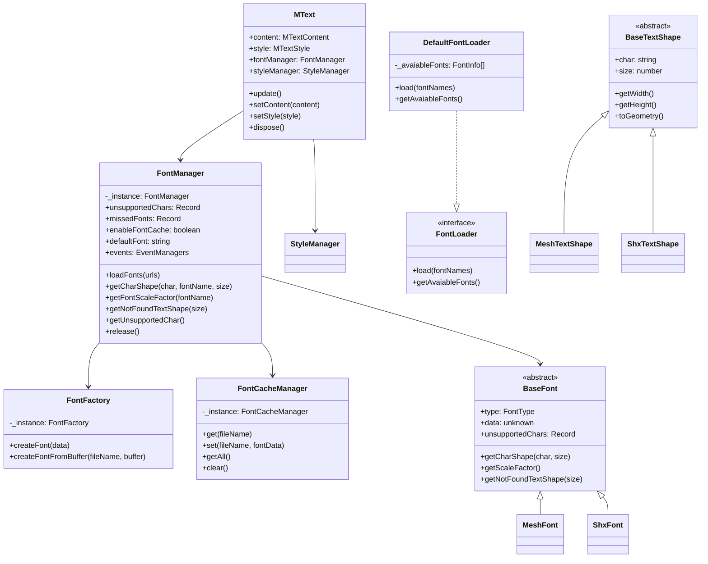

# MText Renderer for Three.js

A flexible and extensible AutoCAD MText renderer implementation using Three.js. This package provides a modular architecture to render AutoCAD MText content with different rendering engines, with a primary focus on Three.js rendering.

## Features

- Render AutoCAD MText content using Three.js
- Modular font loading system
- Font management and dynamic font loading
- Cache parsed fonts to improve rendering performance

## Core Components

### FontManager

The central manager for font operations. It's a singleton class that handles font loading, caching, and text rendering.

**Public Properties:**
- `unsupportedChars`: Record of characters not supported by any loaded font
- `missedFonts`: Record of fonts that were requested but not found
- `enableFontCache`: Flag to enable/disable font caching. If it is true, parsed fonts 
will be stored in local IndexedDB to improve performance. Default value is true.
- `defaultFont`: Default font to use when a requested font is not found
- `events`: Event managers for font-related events
  - `fontNotFound`: Triggered when a font cannot be found
  - `fontLoaded`: Triggered when a font is successfully loaded

**Public Methods:**
- `loadFonts(urls)`: Loads fonts from URLs
- `getCharShape(char, fontName, size)`: Gets text shape for a character
- `getFontScaleFactor(fontName)`: Gets scale factor for a font
- `getNotFoundTextShape(size)`: Gets shape for not found indicator
- `getUnsupportedChar()`: Gets record of unsupported characters
- `release()`: Releases all loaded fonts

### FontLoader & DefaultFontLoader

Interface for font loading operations. The default implementation [DefaultFontLoader](./src/font/defaultFontLoader.ts) uses a [CDN-based font repository](https://cdn.jsdelivr.net/gh/mlight-lee/cad-data/fonts/). It loads font metadata from a JSON file and provides access to available fonts. You can implement one font loader by your own if you want to use fonts hosted in your own server.

**Public Methods:**
- `load(fontNames)`: Loads specified fonts into the system
- `getAvaiableFonts()`: Retrieves information about available fonts

### BaseFont

Abstract base class for font implementations. Provides common functionality for font handling.

**Public Properties:**
- `type`: Type of font ('shx' or 'mesh')
- `data`: Parsed font data
- `unsupportedChars`: Record of unsupported characters

**Public Methods:**
- `getCharShape(char, size)`: Gets shape for a character
- `getScaleFactor()`: Gets font scale factor
- `getNotFoundTextShape(size)`: Gets shape for not found indicator

### BaseTextShape

Abstract base class for text shape implementations. Provides common functionality for text shape handling.

**Public Properties:**
- `char`: Character this shape represents
- `size`: Size of the text shape

**Public Methods:**
- `getWidth()`: Gets width of text shape
- `getHeight()`: Gets height of text shape
- `toGeometry()`: Converts shape to THREE.BufferGeometry

### FontFactory

Singleton factory class for creating font instances. Handles creation of appropriate font objects based on type and data format.

**Public Methods:**
- `createFont(data)`: Creates font from font data
- `createFontFromBuffer(fileName, buffer)`: Creates font from file data

### FontCacheManager
Manages font data caching using IndexedDB. Provides persistent storage for font data.

**Public Methods:**
- `get(fileName)`: Retrieves font data from cache
- `set(fileName, fontData)`: Stores font data in cache
- `getAll()`: Retrieves all cached font data
- `clear()`: Clears all cached font data

### MText
Main class for rendering AutoCAD MText content. Extends THREE.Object3D to integrate with Three.js scene graph.

**Public Properties:**
- `content`: MText content configuration including text, height, width, and position
- `style`: Text style configuration including font, color, and text generation flags
- `fontManager`: Reference to FontManager instance for font operations
- `styleManager`: Reference to StyleManager instance for style operations

**Public Methods:**
- `update()`: Updates the text rendering based on current content and style
- `setContent(content)`: Updates the text content
- `setStyle(style)`: Updates the text style
- `dispose()`: Cleans up resources when the MText instance is no longer needed

## Class Diagram



## Usage

```typescript
import * as THREE from 'three';
import { DefaultFontLoader, FontManager, MText, StyleManager } from '@mlightcad/mtext-renderer';

// Initialize core components
const fontManager = FontManager.instance;
const styleManager = new StyleManager();
const fontLoader = new DefaultFontLoader();

// Load fonts needed
await fontLoader.load(['simsun']);

// Create MText content
const mtextContent = {
    text: '{\\fArial|b0|i0|c0|p34;Hello World}',
    height: 0.1,
    width: 0,
    position: new THREE.Vector3(0, 0, 0)
};

// Create MText instance with style
const mtext = new MText(
    mtextContent,
    {
        name: 'Standard',
        standardFlag: 0,
        fixedTextHeight: 0.1,
        widthFactor: 1,
        obliqueAngle: 0,
        textGenerationFlag: 0,
        lastHeight: 0.1,
        font: 'Standard',
        bigFont: '',
        color: 0xffffff
    },
    styleManager,
    fontManager
);

// Add to Three.js scene
scene.add(mtext);
```

## License

MIT

## Contributing

Contributions are welcome! Please read our contributing guidelines for details. 